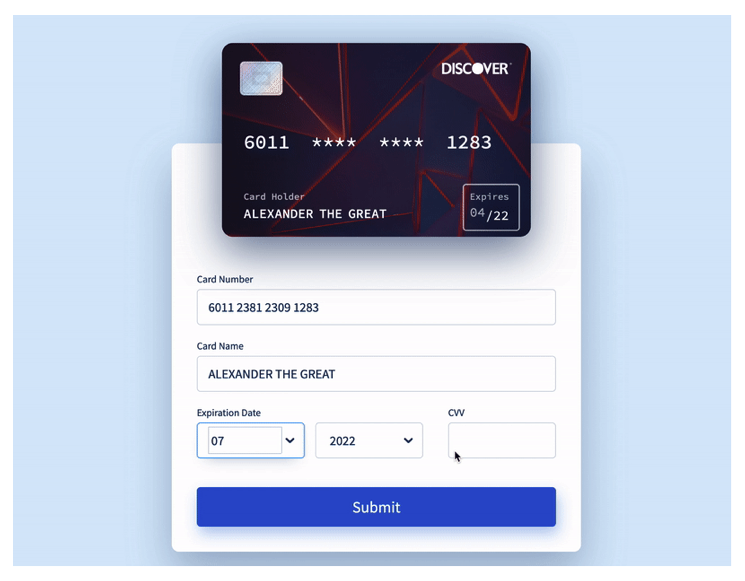

<div align="center">

</div>
<h1 align="center">Motient Frontend Coding Exercise</h1>

<h2 align="center">Meet the Creator</h2>

<h3 align="center">Sarah Creager</h3>
<div align="center">
<a href="https://www.linkedin.com/in/sarah-creager/"></a>
<a href="https://github.com/SarahCreager"></a>
</div>


## Problem Domain

Build a credit card entry form using React to showcase your talent as a developer. 

* The card number input should take numbers only and populate the card preview above as the user types.

* On the card preview, the first four and the last four digits of the card number should be shown in plaintext, the rest should be obscured as * symbols when the input isn’t active.

* The card name should be limited to 50 characters and populate the card preview above as the user types.

* The CVV input should be limited to 3 numbers.

* Don’t worry about changing the vendor (Visa, Discover, etc.) just assume all card numbers are Visa.

* The submit button should console.log() state and a sample payload to be sent to a server.

## Project Overview

| Title      | Languages / Frameworks / Libraries / Tools |
| ----------- | ----------- |
| Frontend | JSX, React, Material UI, SCSS |

## Installation

1. `npm install`
    * @emotion/react
    * @emotion/styled
    * @mui/material
    * @testing-library/jest-dom
    * @testing-library/react
    * @testing-library/user-event
    * react
    * react-dom
    * react-if
    * react-scripts
    * sass
    * web-vitals

2. `npm start`

### _sample .env_

```
REACT_APP_SERVER=placeDatabaseURLHere
```

## User Stories

### Card Number Input Feature

As a user, when I enter my card number into the form, I would like a visual preview on the card as I type

**Feature Tasks:**

User can view the card number on the preview card as they type in the form input field

**Acceptance:**

When the user types in the card number input field, the numbers will appear on the card preview

### Card Number Preview Feature

As a user, when I view my card preview, I would like to only see the first four and last four digits of the card when I'm not typing in the card number

**Feature Tasks:**

On the card preview, the user can view the first four and the last four digits of the card number when not actively typing

**Acceptance:**

When the user has entered in their card number and clicks away from the input field, the card preview will display the first four and the last four digits of the card number in plaintext and the rest obscured as * symbols

### Cardholder Name Input Feature

As a user, when I enter my name into the form, I would like a visual preview on the card as I type

**Feature Tasks:**

User can view their name on the preview card as they type in the form input field

**Acceptance:**

When the user types in the name input field, their name will appear on the card preview

### CVV Input Feature

As a user, when I enter my CVV into the form, I only want to enter 3 numbers

**Feature Tasks:**

User can only enter 3 numbers into CVV input field

**Acceptance:**

When the user types in the CVV input field, they can only enter 3 numbers

### Submit Feature

As a user, when I submit the form, I want to view the current state along with a sample payload

**Feature Tasks:**

User can press submit button to console.log() state and a sample payload to be sent to a server

**Acceptance:**

When the user submits the form, the current state and sample payload will log to the console

## Wireframe



## Resources

* [Unsplash Background Image by Konstantin Pudan](https://unsplash.com/photos/AeWNYVJzu1E)
* [Material UI docs](https://mui.com/getting-started/usage/)
* [Stack Overflow](stackoverflow.com)
* [MDN Docs](https://developer.mozilla.org/en-US/)
* [Medium](https://medium.com/)
* [W3 Schools](https://www.w3schools.com/)
* [ReactJS](https://reactjs.org/)
* [GitHub Projects](https://docs.github.com/en/issues/trying-out-the-new-projects-experience/about-projects)
* [Flipping Card in React](https://codepen.io/elliempatten/pen/KxmoGR)

## Future Implementations

* Ability to toggle hide card number in preview

* Limit card name input to certain characters

* Display an error below the form if input is not in the correct format

* Create a test suite
